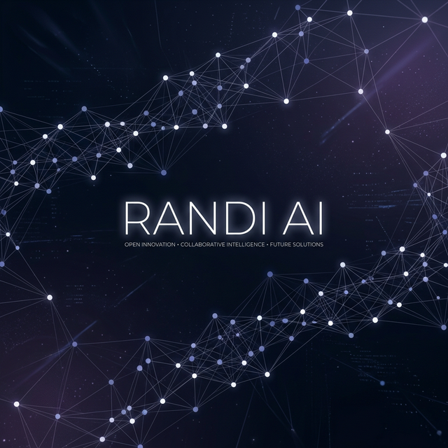
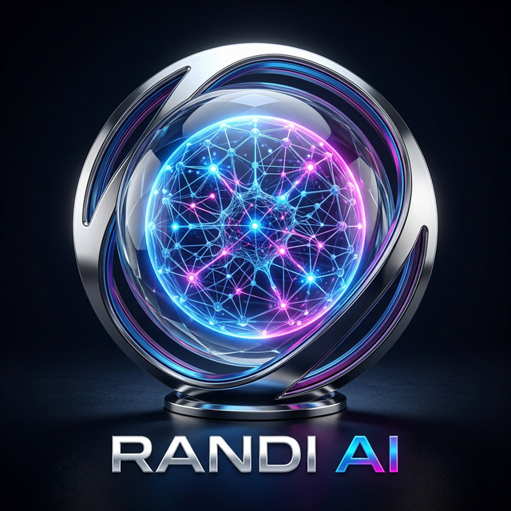

  
  
   
  
  

  # Randi AI
  **Architecting the next generation of autonomous AI agent infrastructure.**

  [Website](https://www.randi.chat/) • [Telegram](https://t.me/RandiAgent) • [GitHub](https://github.com/Randi-Agent/randi-agent)

---

### 🌐 About Randi AI

Randi AI is an open-source research and engineering organization dedicated to building robust orchestration layers for AI agents. We focus on bridging the gap between high-level LLM capabilities and low-level system execution, specifically optimizing for:

- **Security**: Hyper-isolated containerized execution environments.
- **Interoperability**: Standardized interfaces for agent-to-tool and agent-to-agent communication via Composio.
- **Economic Mechanics**: Token-powered incentive structures and usage-based credit systems on Solana.

---

### 🏗️ Primary Repositories

- **[agent-platform](https://github.com/Randi-Agent/agent-platform)**: The core orchestration engine, web interface, and orchestration layer.
- **[agent-sdk](https://github.com/Randi-Agent/agent-sdk)**: (Coming Soon) A lightweight TypeScript/Python SDK for building Randi-compatible agents.
- **[tool-bridge](https://github.com/Randi-Agent/tool-bridge)**: (Coming Soon) Custom tool connectors for enterprise SaaS platforms.

---

### 🚀 Our Mission

We believe the future of work is collaborative between humans and autonomous agents. Our mission is to provide the **infrastructure of trust** and the **connective tissue** that allows these agents to operate securely, transparently, and effectively at scale.

---

### 🤝 Join the Ecosystem

We are an community-first organization. Whether you are an AI researcher, a full-stack engineer, or a web3 enthusiast, there is a place for you here.

- **Contribute**: Look for `good first issue` tags in our repositories.
- **Discuss**: Join our [Telegram](https://t.me/RandiAgent) to brainstorm new features or report issues.
- **Integrate**: Check out our [core repository](https://github.com/Randi-Agent/randi-agent) to start building on top of the Randi platform.

---

  &copy; 2026 Randi AI Organization. All rights reserved.

